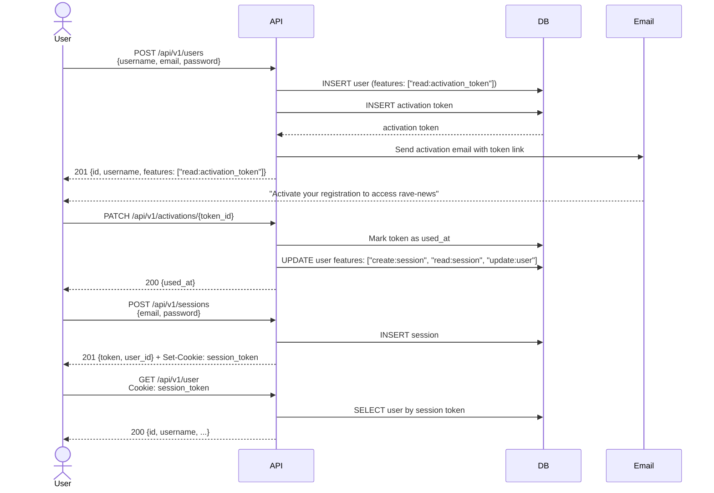

# Use Case: Registration Flow

```mermaid
sequenceDiagram
    actor User
    participant API
    participant DB
    participant Email

    User->>API: POST /api/v1/users<br/>{username, email, password}
    API->>DB: INSERT user (features: ["read:activation_token"])
    API->>DB: INSERT activation token
    DB-->>API: activation token
    API->>Email: Send activation email with token link
    API-->>User: 201 {id, username, features: ["read:activation_token"]}

    Email-->>User: "Activate your registration to access rave-news"

    User->>API: PATCH /api/v1/activations/{token_id}
    API->>DB: Mark token as used_at
    API->>DB: UPDATE user features: ["create:session", "read:session", "update:user"]
    API-->>User: 200 {used_at}

    User->>API: POST /api/v1/sessions<br/>{email, password}
    API->>DB: INSERT session
    API-->>User: 201 {token, user_id} + Set-Cookie: session_token

    User->>API: GET /api/v1/user<br/>Cookie: session_token
    API->>DB: SELECT user by session token
    API-->>User: 200 {id, username, ...}
```
